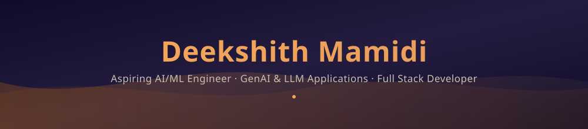

<div align="center">



<a href="https://git.io/typing-svg">
  
</a>

<br/>


<br/><br/>

<a href="https://deekshithmamidi.netlify.app/"></a>
<a href="https://www.linkedin.com/in/deekshith-mamidi/"></a>
<a href="mailto:deekshith.mamidi19@gmail.com"></a>
<a href="https://github.com/Deekshith1901"></a>

<br/><br/>


</div>

<br/>

---

##  About Me

```yaml
engineer:
  name: "Deekshith Mamidi"
  role: "Aspiring AI/ML Engineer • GenAI & LLM Application Builder • Full Stack Developer"
  education: "B.Tech CS (AI & Data Science), IFHE Hyderabad — 2027"
  focus:
    - GenAI/LLM applications — prompt engineering, RAG concepts, OpenAI/GPT API integration
    - End-to-end ML workflows — data cleaning, feature engineering, model evaluation
    - Full stack development — React, Next.js, Node.js, REST APIs, SQL-based data modeling
  edge: "Comfortable across the entire stack — from Pandas/Scikit-Learn pipelines to
         shipped, deployed products people actually use. I ship prototypes to production,
         not just notebooks."
  currently: "Deepening GenAI fundamentals through the IIT Ropar Major in AI program."
```

**I build things people can use, not just things that run once.** My work spans GenAI web apps shipped to real users, ML pipelines that go from raw data to interactive dashboards, and full-stack platforms with real authentication, databases, and REST APIs. As an AI Developer Intern at VISWAM.AI (IIIT Hyderabad × Meta), I built and deployed 2 open-source GenAI apps supporting 40+ active user sessions across multiple languages.

<table>
<tr>
<td>

**🎯 Open To**
- GenAI / LLM & Agentic Application roles
- AI/ML Engineering Internships
- Product Engineering Internships
- Full Stack Engineering Internships
- Hyderabad-based & Remote opportunities

</td>
</tr>
</table>

---

##  Tech Stack

<div align="center">

**Languages**
<br/>


**Frontend**
<br/>


**Backend & Databases**
<br/>


**GenAI / ML**
<br/>


**Auth & Tools**
<br/>


</div>

---

##  Areas of Focus

<div align="center">

| Domain | Details |
|---|---|
| **GenAI / LLM Integration** | Prompt engineering, OpenAI/GPT API integration, RAG concepts, OCR-based pipelines |
| **ML / Data Workflows** | Data cleaning, feature engineering, model evaluation & benchmarking with Pandas & Scikit-Learn |
| **Backend & APIs** | Flask, Streamlit, Node.js/Express, REST API design, JWT & OAuth 2.0 |
| **Databases** | PostgreSQL, Supabase, SQLite, MongoDB — schema design & querying |
| **Frontend** | React, Next.js, Tailwind CSS — responsive, production-ready UI |
| **Practices** | Git/GitHub workflows, Agile/Scrum, unit/integration testing, debugging & root-cause analysis |

</div>

---

##  Featured Projects

<details open>
<summary><b>🔶 BazaarCast — AI Retail Demand Forecasting System</b></summary>
<br/>

End-to-end retail demand forecasting platform covering data cleaning, feature engineering, and ML model evaluation, with interactive dashboards for business insight generation.

| Attribute | Detail |
|---|---|
| **Stack** | Python · Pandas · Scikit-Learn · Streamlit |
| **Features** | Interactive dashboards, model performance validation across input scenarios |
| **Status** | Live |
| **Repository** | [github.com/Deekshith1901/BazaarCast-AI-Retail-Demand-Forecasting](https://github.com/Deekshith1901/BazaarCast-AI-Retail-Demand-Forecasting) |

</details>

<details>
<summary><b>🔶 Label-It — Multilingual Image Labeling Platform</b></summary>
<br/>

Multilingual (13 Indian languages + English) image labeling platform with user authentication, category-based labeling, and automatic geolocation capture — built and deployed during my AI Developer Internship at VISWAM.AI.

| Attribute | Detail |
|---|---|
| **Stack** | Python · Streamlit · SQLite · Plotly · Pillow |
| **Features** | SQLite data models for images/labels/users, interactive Plotly analytics dashboard, dataset export for downstream CV/AI training |
| **Status** | Live |
| **Repository** | [github.com/Deekshith1901/Label-It](https://github.com/Deekshith1901/Label-It) |

</details>

<details>
<summary><b>🔶 College Compass — Full-Stack College Discovery Platform</b></summary>
<br/>

Full-stack platform for exploring, comparing, and bookmarking colleges, with search, filters, rankings, and side-by-side comparisons backed by a RESTful Express.js API.

| Attribute | Detail |
|---|---|
| **Stack** | Next.js · TypeScript · Node.js · Express.js · Supabase (PostgreSQL) · Tailwind CSS |
| **Features** | Search & filters, ranking comparisons, RESTful API, Supabase-backed data layer |
| **Status** | Live |
| **Repository** | [github.com/Deekshith1901/collegecompass](https://github.com/Deekshith1901/collegecompass) |

</details>

---

##  Experience

### AI Developer Intern · VISWAM.AI — IIIT Hyderabad, Meta
**May 2025 – Jul 2025**

- Built and deployed 2+ open-source GenAI web applications (CultureBot, Label-It) on Hugging Face Spaces using Python, Streamlit, and GPT APIs — supporting 3+ languages and 40+ active user sessions
- Architected Label-It with authentication and a backend for structured dataset creation, debugging integration issues across the application stack

`Python` `Streamlit` `GPT APIs` `Hugging Face Spaces`

<br/>

### Front-End Web Development Intern · Edunet Foundation — IBM SkillsBuild (AICTE)
**Aug 2025 – Oct 2025**

- Completed a 6-week intensive program in HTML, CSS, and JavaScript
- Delivered a capstone project with responsive design and cross-browser compatibility, earning joint AICTE & Edunet certification

`HTML` `CSS` `JavaScript`

<br/>

### System Administrator Intern (Virtual) · ServiceNow — AICTE Eduskills
**May 2025 – Aug 2025**

- Completed a structured virtual internship covering ServiceNow platform fundamentals and ITSM workflows
- Implemented and validated ITSM workflows, earning the AICTE ServiceNow certification

`ServiceNow` `ITSM`

---

##  Achievements

<div align="center">

| Recognition | Details |
|---|---|
| 🏆 **Smart India Hackathon 2025** | Round 2 Qualifier |
| 🥈 **TechSprint (GDG on Campus)** | 2nd Place |
| 🎓 **ABC Club** | Member |

</div>

---

##  Certifications


---

##  Coding Profiles

<div align="center">

<a href="https://leetcode.com/u/uBlyy3VfC7/"></a>
<a href="https://github.com/Deekshith1901"></a>

</div>

---

##  GitHub Analytics

<div align="center">


<br/>


</div>

---

##  Contribution Activity

<div align="center">


</div>

---

##  Contribution Snake

<div align="center">


</div>

<!--
  To activate the snake animation above, add this GitHub Actions workflow to your
  Deekshith1901/Deekshith1901 repo at .github/workflows/snake.yml:

  name: Generate Snake
  on:
    schedule: [{cron: "0 0 * * *"}]
    workflow_dispatch: {}
  jobs:
    generate:
      runs-on: ubuntu-latest
      steps:
        - uses: Platane/snk/svg-only@v3
          with:
            github_user_name: Deekshith1901
            outputs: dist/github-contribution-grid-snake-dark.svg
        - uses: crazy-max/ghaction-github-pages@v4
          with:
            target_branch: output
            build_dir: dist
          env:
            GITHUB_TOKEN: ${{ secrets.GITHUB_TOKEN }}
-->

---

##  Current Focus

```yaml
current_focus:
  learning:
    - Retrieval-Augmented Generation (RAG) with LangChain / LlamaIndex
    - Vector databases (FAISS / Pinecone) and agentic AI workflows
    - System design fundamentals
  building:
    - New GenAI/LLM projects extending prompt-engineering & RAG experience
    - Deepening BazaarCast and College Compass with AI-powered features
  open_to:
    - GenAI / LLM & Agentic Application roles
    - AI/ML Engineering Internships
    - Product Engineering Internships
    - Hyderabad-based & Remote opportunities
```

---

##  Connect

<div align="center">

<a href="mailto:deekshith.mamidi19@gmail.com"></a>
<a href="https://www.linkedin.com/in/deekshith-mamidi/"></a>
<a href="https://github.com/Deekshith1901"></a>
<a href="https://deekshithmamidi.netlify.app/"></a>

</div>

---

<div align="center">

*"The best way to predict the future is to build it." — Alan Kay*


</div>
